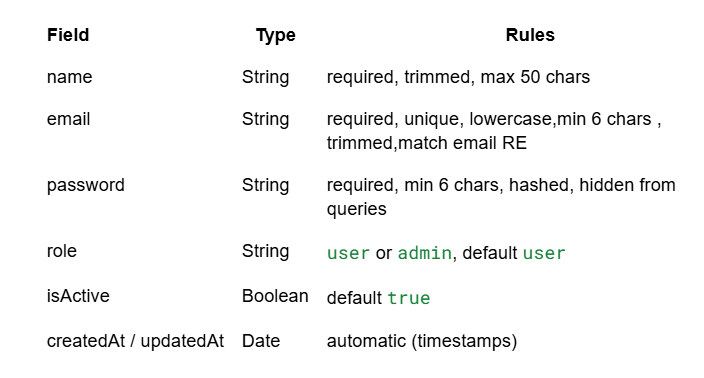
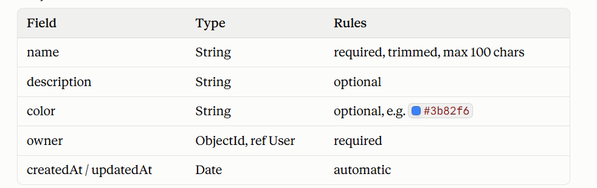
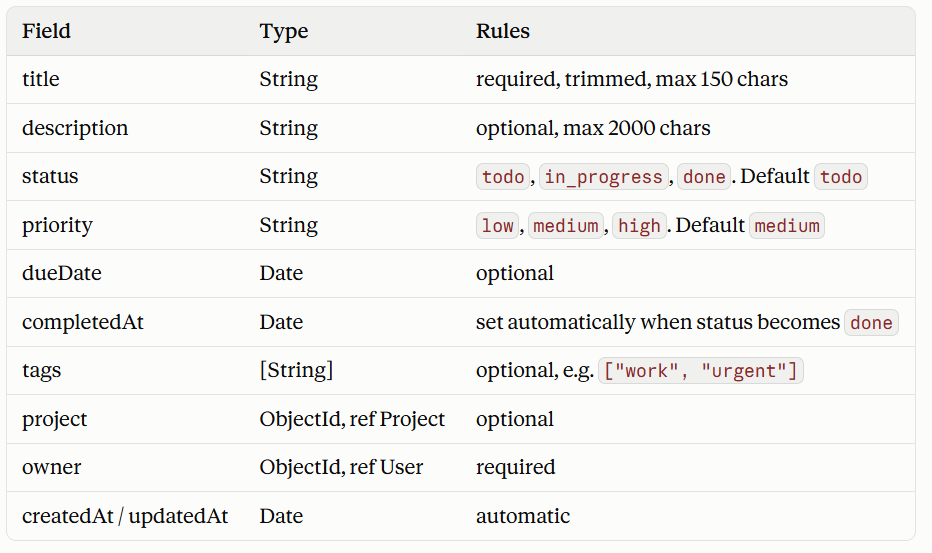
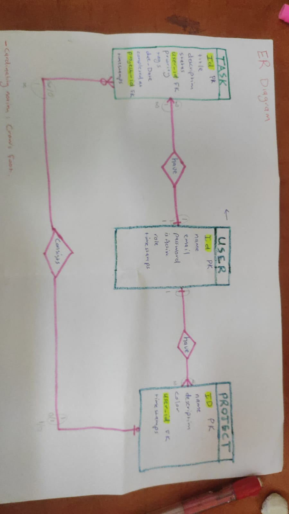

1- Who will use the system ? 
User: Register , login , manage their own tasks and projects . 
Admin: everything a user can do plus view and deactivate users and manage the overall system.

2- Database design 
A- Entities 
1- User 
2- Task
3- Project

B- Relationships
1- User can have many tasks and each task is assigned only to one user 
2- User can have many projects and each project is assigned only to one user 
3- The project can have zero or more tasks 

C- Tables
1- User 

2- Project

3- Task

D- ER diagram 

Note: some points they will be enforced in code .